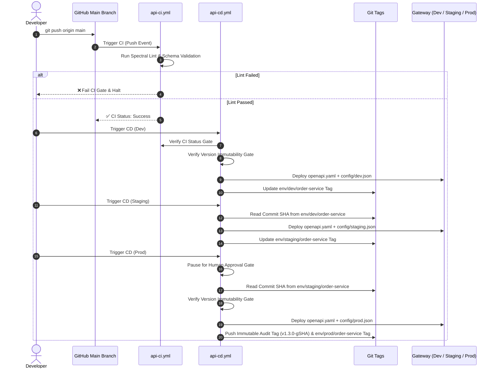

# Complete Walkthrough: Implementing GitOps for OpenAPI & API Gateway Deployment

This document provides a **complete, step-by-step implementation walkthrough** for building a GitOps pipeline for OpenAPI (Swagger) specifications and deploying them to an API Gateway (such as Azure API Management).

It details **all real-world use cases**, execution timelines, safety gates, and includes the **complete, exact source code** of all workflows, scripts, and configuration files.

---

## Table of Contents
1. [Overview & Execution Timeline](#1-overview--execution-timeline)
2. [Complete Source Code of GitOps Files](#2-complete-source-code-of-gitops-files)
   - [2.1 Spectral Linter Configuration (`.spectral.yaml`)](#21-spectral-linter-configuration-spectralyaml)
   - [2.2 Repository Ownership (`.github/CODEOWNERS`)](#22-repository-ownership-githubcodeowners)
   - [2.3 CI Validation Workflow (`.github/workflows/api-ci.yml`)](#23-ci-validation-workflow-githubworkflowsapi-ciyml)
   - [2.4 CD Multi-Environment Workflow (`.github/workflows/api-cd.yml`)](#24-cd-multi-environment-workflow-githubworkflowsapi-cdyml)
   - [2.5 APIM Deployment Script (`scripts/deploy-apim.js`)](#25-apim-deployment-script-scriptsdeploy-apimjs)
   - [2.6 Workflow Trigger Script (`scripts/trigger-deploy.js`)](#26-workflow-trigger-script-scriptstrigger-deployjs)
   - [2.7 Example API Specification & Overlay Configs](#27-example-api-specification--overlay-configs)
3. [Walkthrough of All End-to-End Use Cases](#3-walkthrough-of-all-end-to-end-use-cases)
   - [Use Case 1: Initializing a New API Service](#use-case-1-initializing-a-new-api-service)
   - [Use Case 2: Non-Breaking API Spec Modification & Promotion](#use-case-2-non-breaking-api-spec-modification--promotion)
   - [Use Case 3: Invalid API Spec Commit (CI Quality Gate Failure)](#use-case-3-invalid-api-spec-commit-ci-quality-gate-failure)
   - [Use Case 4: Overwrite Attempt Without SemVer Bump (Version Immutability Gate)](#use-case-4-overwrite-attempt-without-semver-bump-version-immutability-gate)
   - [Use Case 5: Sequential Promotion Across Dev → Staging → Prod](#use-case-5-sequential-promotion-across-dev--staging--prod)
   - [Use Case 6: Script-Triggered & Dispatch Deployment](#use-case-6-script-triggered--dispatch-deployment)
   - [Use Case 7: Audit Tracking & Point-in-Time Rollbacks](#use-case-7-audit-tracking--point-in-time-rollbacks)
4. [Step-by-Step Guide to Implement in a New Repository](#4-step-by-step-guide-to-implement-in-a-new-repository)

---

## 1. Overview & Execution Timeline

### When Everything Runs (Trigger Matrix)

| Event / Action | Trigger Condition | Workflow Executed | Actions Taken |
| :--- | :--- | :--- | :--- |
| **Commit Pushed to `main`** | File under `apis/**`, `.spectral.yaml`, or `api-ci.yml` modified | [`api-ci.yml`](file:///c:/Users/marcu/Projects/AG/cicd/.github/workflows/api-ci.yml) | 1. Detects modified services via `git diff`<br>2. Runs Spectral linter in matrix parallel<br>3. Verifies schema syntax |
| **Dev Deployment Trigger** | Manual Dispatch / Script Trigger (`environment: dev`) | [`api-cd.yml`](file:///c:/Users/marcu/Projects/AG/cicd/.github/workflows/api-cd.yml) (`deploy-dev`) | 1. Verifies CI status gate<br>2. Combines `openapi.yaml` + `config/dev.json`<br>3. Deploys to Dev APIM<br>4. Updates `env/dev/<service>` tag |
| **Staging Promotion** | Manual Dispatch / Script Trigger (`environment: staging`) | [`api-cd.yml`](file:///c:/Users/marcu/Projects/AG/cicd/.github/workflows/api-cd.yml) (`deploy-staging`) | 1. Resolves commit SHA from `env/dev/<service>`<br>2. Combines `openapi.yaml` + `config/staging.json`<br>3. Deploys to Staging APIM<br>4. Updates `env/staging/<service>` tag |
| **Production Deployment** | Manual Dispatch / Script Trigger (`environment: prod`) | [`api-cd.yml`](file:///c:/Users/marcu/Projects/AG/cicd/.github/workflows/api-cd.yml) (`deploy-prod`) | 1. Resolves commit SHA from `env/staging/<service>`<br>2. **Pauses for Human Approval Gate**<br>3. Verifies Version Immutability Gate<br>4. Deploys to Prod APIM<br>5. Creates Audit Tag `service/prod/vX.Y.Z-gSHA` + `env/prod/<service>` pointer |

---

## 2. Complete Source Code of GitOps Files

Below is the full, unedited source code for all components in this repository.

### 2.1 Spectral Linter Configuration ([`.spectral.yaml`](file:///c:/Users/marcu/Projects/AG/cicd/.spectral.yaml))

```yaml
extends: ["spectral:oas"]

rules:
  operation-operationId: error
  operation-tags: error
  info-contact: off
  info-description: warn
  operation-description: warn
```

---

### 2.2 Repository Ownership ([`.github/CODEOWNERS`](file:///c:/Users/marcu/Projects/AG/cicd/.github/CODEOWNERS))

```text
# Global default code owners
*                       @apim-core-team

# Service-specific ownership rules
/apis/order-service/    @orders-team @apim-core-team
/apis/user-service/     @users-team @apim-core-team
```

---

### 2.3 CI Validation Workflow ([`.github/workflows/api-ci.yml`](file:///c:/Users/marcu/Projects/AG/cicd/.github/workflows/api-ci.yml))

```yaml
name: API CI - Lint & Validate

on:
  push:
    branches:
      - main
    paths:
      - 'apis/**'
      - '.spectral.yaml'
      - '.github/workflows/api-ci.yml'

jobs:
  detect-changes:
    name: Detect Changed API Services
    runs-on: ubuntu-latest
    outputs:
      matrix: ${{ steps.set-matrix.outputs.matrix }}
      has_changes: ${{ steps.set-matrix.outputs.has_changes }}
    steps:
      - name: Checkout Code
        uses: actions/checkout@v4
        with:
          fetch-depth: 0

      - name: Find Changed Services
        id: set-matrix
        run: |
          CHANGED_FILES=$(git diff --name-only HEAD~1 HEAD 2>/dev/null || echo "apis/order-service/openapi.yaml apis/user-service/openapi.yaml")
          SERVICES=$(echo "$CHANGED_FILES" | grep '^apis/' | cut -d'/' -f2 | sort -u | jq -R . | jq -s -c .)
          echo "Detected changed API services: $SERVICES"
          if [ "$SERVICES" == "[]" ] || [ "$SERVICES" == "" ]; then
            echo "has_changes=true" >> $GITHUB_OUTPUT
            echo "matrix=[\"order-service\", \"user-service\"]" >> $GITHUB_OUTPUT
          else
            echo "has_changes=true" >> $GITHUB_OUTPUT
            echo "matrix=$SERVICES" >> $GITHUB_OUTPUT
          fi

  lint-and-validate:
    name: Lint & Validate Specs
    needs: detect-changes
    if: needs.detect-changes.outputs.has_changes == 'true'
    runs-on: ubuntu-latest
    strategy:
      matrix:
        service: ${{ fromJson(needs.detect-changes.outputs.matrix) }}
    steps:
      - name: Checkout Code
        uses: actions/checkout@v4
        with:
          fetch-depth: 0

      - name: Fetch All Git Tags
        run: git fetch --tags origin || true

      - name: Setup Node.js
        uses: actions/setup-node@v4
        with:
          node-version: '20'

      - name: Install Spectral CLI
        run: |
          npm install -g @stoplight/spectral-cli

      - name: Lint OpenAPI Spec (Spectral)
        run: |
          echo "🔍 Linting apis/${{ matrix.service }}/openapi.yaml..."
          spectral lint apis/${{ matrix.service }}/openapi.yaml --ruleset .spectral.yaml

      - name: Check Schema Integrity
        run: |
          echo "✅ Validating OpenAPI Schema syntax..."
          spectral lint apis/${{ matrix.service }}/openapi.yaml
```

---

### 2.4 CD Multi-Environment Workflow ([`.github/workflows/api-cd.yml`](file:///c:/Users/marcu/Projects/AG/cicd/.github/workflows/api-cd.yml))

```yaml
name: API CD - Script-Triggered GitOps Deployment

on:
  workflow_dispatch:
    inputs:
      service:
        description: 'API Service to deploy'
        required: true
        type: choice
        options:
          - order-service
          - user-service
          - all
        default: 'order-service'
      environment:
        description: 'Target Environment'
        required: true
        type: choice
        options:
          - dev
          - staging
          - prod
        default: 'dev'

permissions:
  contents: write

jobs:
  detect-services:
    name: Determine Target Service
    runs-on: ubuntu-latest
    outputs:
      matrix: ${{ steps.set-matrix.outputs.matrix }}
    steps:
      - name: Parse Service Input
        id: set-matrix
        run: |
          INPUT_SERVICE="${{ github.event.inputs.service }}"
          if [ "$INPUT_SERVICE" == "all" ]; then
            SERVICES='["order-service", "user-service"]'
          else
            SERVICES=$(jq -n -c --arg s "$INPUT_SERVICE" '[$s]')
          fi
          echo "Target services: $SERVICES"
          echo "matrix=$SERVICES" >> $GITHUB_OUTPUT

  deploy-dev:
    name: Deploy to Dev
    needs: detect-services
    if: github.event.inputs.environment == 'dev'
    runs-on: ubuntu-latest
    environment: dev
    strategy:
      matrix:
        service: ${{ fromJson(needs.detect-services.outputs.matrix) }}
    steps:
      - name: Checkout Code
        uses: actions/checkout@v4
        with:
          fetch-depth: 0

      - name: Verify CI Status Gate
        run: |
          echo "🔍 Checking CI validation status for commit ${{ github.sha }}..."
          CHECKS_JSON=$(curl -s -H "Authorization: token ${{ secrets.GITHUB_TOKEN }}" \
            -H "Accept: application/vnd.github.v3+json" \
            https://api.github.com/repos/${{ github.repository }}/commits/${{ github.sha }}/check-runs)

          CI_CONCLUSION=$(echo "$CHECKS_JSON" | jq -r '.check_runs[] | select(.name | contains("Lint")) | .conclusion' | sort -u | head -n 1)
          echo "CI Check Result for '${{ matrix.service }}': '$CI_CONCLUSION'"
          if [ "$CI_CONCLUSION" != "success" ]; then
            echo "❌ ABORT DEPLOYMENT: CI check is '$CI_CONCLUSION' (must be 'success') for commit ${{ github.sha }}!"
            exit 1
          fi
          echo "✅ CI Status Gate Passed. Proceeding to APIM Dev deployment..."

      - name: Verify Version Immutability Gate
        run: |
          echo "🔍 Checking Post-Production Version Immutability..."
          PROD_TAG="env/prod/${{ matrix.service }}"
          if git rev-parse "$PROD_TAG" >/dev/null 2>&1; then
            PROD_SHA=$(git rev-parse "$PROD_TAG")
            NEW_SHA="${{ github.sha }}"

            if [ "$PROD_SHA" != "$NEW_SHA" ]; then
              PROD_VERSION=$(git show "$PROD_TAG:apis/${{ matrix.service }}/openapi.yaml" | node -e "const fs=require('fs'); const c=fs.readFileSync(0,'utf8'); const m=c.match(/version:\s*['\"]?([^'\"\s]+)['\"]?/); console.log(m ? m[1] : '1.0.0');")
              NEW_VERSION=$(node -e "const fs=require('fs'); const c=fs.readFileSync('apis/${{ matrix.service }}/openapi.yaml','utf8'); const m=c.match(/version:\s*['\"]?([^'\"\s]+)['\"]?/); console.log(m ? m[1] : '1.0.0');")

              echo "   Production Version: '$PROD_VERSION' (Commit: ${PROD_SHA:0:7})"
              echo "   New Spec Version:   '$NEW_VERSION' (Commit: ${NEW_SHA:0:7})"

              if [ "$NEW_VERSION" == "$PROD_VERSION" ]; then
                echo "❌ ABORT DEPLOYMENT: Version '$PROD_VERSION' has already been published to Production!"
                echo "   You cannot deploy new spec modifications without bumping 'info.version' in openapi.yaml."
                echo "   Please bump 'info.version' (e.g. to next version) before deploying."
                exit 1
              fi
            fi
          fi
          echo "✅ Version Immutability Gate Passed."

      - name: Setup Node.js
        uses: actions/setup-node@v4
        with:
          node-version: '20'

      - name: Deploy to Dev APIM
        run: |
          node scripts/deploy-apim.js --api ${{ matrix.service }} --env dev

      - name: Run Dev Smoke Tests
        run: |
          echo "🧪 Running automated integration tests against Dev APIM for ${{ matrix.service }}..."
          echo "✅ All Dev tests passed!"

      - name: Create & Push Deployment Git Tags
        run: |
          SPEC_VERSION=$(node -e "const fs=require('fs'); const c=fs.readFileSync('apis/${{ matrix.service }}/openapi.yaml','utf8'); const m=c.match(/version:\s*['\"]?([^'\"\s]+)['\"]?/); console.log(m ? m[1] : '1.0.0');")
          SHORT_SHA=$(echo "${{ github.sha }}" | cut -c1-7)
          AUDIT_TAG="${{ matrix.service }}/dev/v${SPEC_VERSION}-g${SHORT_SHA}"
          MOVING_TAG="env/dev/${{ matrix.service }}"

          git config user.name "github-actions[bot]"
          git config user.email "github-actions[bot]@users.noreply.github.com"

          # Push Immutable Audit Tag
          git tag -f -a "$AUDIT_TAG" -m "Automated deployment of ${{ matrix.service }} v${SPEC_VERSION} to dev at commit ${SHORT_SHA}"
          git push origin "$AUDIT_TAG" --force

          # Push/Update Moving Pointer Tag
          git tag -f "$MOVING_TAG" ${{ github.sha }}
          git push origin "$MOVING_TAG" --force

  deploy-staging:
    name: Deploy to Staging
    needs: detect-services
    if: github.event.inputs.environment == 'staging'
    runs-on: ubuntu-latest
    environment: staging
    strategy:
      matrix:
        service: ${{ fromJson(needs.detect-services.outputs.matrix) }}
    steps:
      - name: Checkout Code
        uses: actions/checkout@v4
        with:
          fetch-depth: 0

      - name: Resolve Target Commit from Dev (Sequential Promotion)
        id: resolve-commit
        run: |
          DEV_TAG="env/dev/${{ matrix.service }}"
          if git rev-parse "$DEV_TAG" >/dev/null 2>&1; then
            TARGET_SHA=$(git rev-parse "$DEV_TAG")
            echo "📍 Sequential Promotion: Checkout commit '$TARGET_SHA' (currently active in Dev)"
            git checkout "$TARGET_SHA"
            echo "target_sha=$TARGET_SHA" >> $GITHUB_OUTPUT
            echo "TARGET_SHA=$TARGET_SHA" >> $GITHUB_ENV
          else
            echo "⚠️ No Dev deployment tag found ($DEV_TAG). Deploying current commit."
            echo "target_sha=${{ github.sha }}" >> $GITHUB_OUTPUT
            echo "TARGET_SHA=${{ github.sha }}" >> $GITHUB_ENV
          fi

      - name: Verify CI Status Gate
        run: |
          echo "🔍 Checking CI validation status for commit ${{ env.TARGET_SHA }}..."
          CHECKS_JSON=$(curl -s -H "Authorization: token ${{ secrets.GITHUB_TOKEN }}" \
            -H "Accept: application/vnd.github.v3+json" \
            https://api.github.com/repos/${{ github.repository }}/commits/${{ env.TARGET_SHA }}/check-runs)

          CI_CONCLUSION=$(echo "$CHECKS_JSON" | jq -r '.check_runs[] | select(.name | contains("Lint")) | .conclusion' | sort -u | head -n 1)
          if [ "$CI_CONCLUSION" != "success" ]; then
            echo "❌ ABORT DEPLOYMENT: CI check is '$CI_CONCLUSION' for commit ${{ env.TARGET_SHA }}!"
            exit 1
          fi
          echo "✅ CI Status Gate Passed. Proceeding to APIM Staging deployment..."

      - name: Setup Node.js
        uses: actions/setup-node@v4
        with:
          node-version: '20'

      - name: Deploy to Staging APIM
        run: |
          node scripts/deploy-apim.js --api ${{ matrix.service }} --env staging

      - name: Create & Push Deployment Git Tags
        run: |
          SPEC_VERSION=$(node -e "const fs=require('fs'); const c=fs.readFileSync('apis/${{ matrix.service }}/openapi.yaml','utf8'); const m=c.match(/version:\s*['\"]?([^'\"\s]+)['\"]?/); console.log(m ? m[1] : '1.0.0');")
          SHORT_SHA=$(echo "${{ env.TARGET_SHA }}" | cut -c1-7)
          AUDIT_TAG="${{ matrix.service }}/staging/v${SPEC_VERSION}-g${SHORT_SHA}"
          MOVING_TAG="env/staging/${{ matrix.service }}"

          git config user.name "github-actions[bot]"
          git config user.email "github-actions[bot]@users.noreply.github.com"

          git tag -f -a "$AUDIT_TAG" -m "Automated deployment of ${{ matrix.service }} v${SPEC_VERSION} to staging at commit ${SHORT_SHA}"
          git push origin "$AUDIT_TAG" --force

          git tag -f "$MOVING_TAG" ${{ env.TARGET_SHA }}
          git push origin "$MOVING_TAG" --force

  deploy-prod:
    name: Deploy to Production
    needs: detect-services
    if: github.event.inputs.environment == 'prod'
    runs-on: ubuntu-latest
    environment: production
    strategy:
      matrix:
        service: ${{ fromJson(needs.detect-services.outputs.matrix) }}
    steps:
      - name: Checkout Code
        uses: actions/checkout@v4
        with:
          fetch-depth: 0

      - name: Resolve Target Commit from Staging (Sequential Promotion)
        id: resolve-commit
        run: |
          STAGING_TAG="env/staging/${{ matrix.service }}"
          if git rev-parse "$STAGING_TAG" >/dev/null 2>&1; then
            TARGET_SHA=$(git rev-parse "$STAGING_TAG")
            echo "📍 Sequential Promotion: Checkout commit '$TARGET_SHA' (currently active in Staging)"
            git checkout "$TARGET_SHA"
            echo "TARGET_SHA=$TARGET_SHA" >> $GITHUB_ENV
          else
            echo "TARGET_SHA=${{ github.sha }}" >> $GITHUB_ENV
          fi

      - name: Verify CI Status Gate
        run: |
          CHECKS_JSON=$(curl -s -H "Authorization: token ${{ secrets.GITHUB_TOKEN }}" \
            -H "Accept: application/vnd.github.v3+json" \
            https://api.github.com/repos/${{ github.repository }}/commits/${{ env.TARGET_SHA }}/check-runs)

          CI_CONCLUSION=$(echo "$CHECKS_JSON" | jq -r '.check_runs[] | select(.name | contains("Lint")) | .conclusion' | sort -u | head -n 1)
          if [ "$CI_CONCLUSION" != "success" ]; then
            echo "❌ ABORT DEPLOYMENT: CI check is '$CI_CONCLUSION'!"
            exit 1
          fi

      - name: Verify Version Immutability Gate
        run: |
          PROD_TAG="env/prod/${{ matrix.service }}"
          if git rev-parse "$PROD_TAG" >/dev/null 2>&1; then
            PROD_SHA=$(git rev-parse "$PROD_TAG")
            NEW_SHA="${{ env.TARGET_SHA }}"

            if [ "$PROD_SHA" != "$NEW_SHA" ]; then
              PROD_VERSION=$(git show "$PROD_TAG:apis/${{ matrix.service }}/openapi.yaml" | node -e "const fs=require('fs'); const c=fs.readFileSync(0,'utf8'); const m=c.match(/version:\s*['\"]?([^'\"\s]+)['\"]?/); console.log(m ? m[1] : '1.0.0');")
              NEW_VERSION=$(node -e "const fs=require('fs'); const c=fs.readFileSync('apis/${{ matrix.service }}/openapi.yaml','utf8'); const m=c.match(/version:\s*['\"]?([^'\"\s]+)['\"]?/); console.log(m ? m[1] : '1.0.0');")

              if [ "$NEW_VERSION" == "$PROD_VERSION" ]; then
                echo "❌ ABORT DEPLOYMENT: Version '$PROD_VERSION' has already been published to Production!"
                exit 1
              fi
            fi
          fi

      - name: Setup Node.js
        uses: actions/setup-node@v4
        with:
          node-version: '20'

      - name: Deploy to Prod APIM
        run: |
          node scripts/deploy-apim.js --api ${{ matrix.service }} --env prod

      - name: Create & Push Deployment Git Tags
        run: |
          SPEC_VERSION=$(node -e "const fs=require('fs'); const c=fs.readFileSync('apis/${{ matrix.service }}/openapi.yaml','utf8'); const m=c.match(/version:\s*['\"]?([^'\"\s]+)['\"]?/); console.log(m ? m[1] : '1.0.0');")
          SHORT_SHA=$(echo "${{ env.TARGET_SHA }}" | cut -c1-7)
          AUDIT_TAG="${{ matrix.service }}/prod/v${SPEC_VERSION}-g${SHORT_SHA}"
          MOVING_TAG="env/prod/${{ matrix.service }}"

          git config user.name "github-actions[bot]"
          git config user.email "github-actions[bot]@users.noreply.github.com"

          git tag -f -a "$AUDIT_TAG" -m "Automated deployment of ${{ matrix.service }} v${SPEC_VERSION} to prod at commit ${SHORT_SHA}"
          git push origin "$AUDIT_TAG" --force

          git tag -f "$MOVING_TAG" ${{ env.TARGET_SHA }}
          git push origin "$MOVING_TAG" --force
```

---

### 2.5 APIM Deployment Script ([`scripts/deploy-apim.js`](file:///c:/Users/marcu/Projects/AG/cicd/scripts/deploy-apim.js))

```javascript
const fs = require('fs');
const path = require('path');

function parseArgs() {
  const args = process.argv.slice(2);
  let api = '';
  let env = '';

  for (let i = 0; i < args.length; i++) {
    if (args[i] === '--api' && i + 1 < args.length) api = args[i + 1];
    else if (args[i] === '--env' && i + 1 < args.length) env = args[i + 1];
  }

  if (!api || !env) {
    console.error('Usage: node scripts/deploy-apim.js --api <service-name> --env <dev|staging|prod>');
    process.exit(1);
  }

  return { api, env };
}

function main() {
  const { api, env } = parseArgs();
  console.log(`==================================================`);
  console.log(`🚀 Starting APIM Deployment Simulation`);
  console.log(`   API Service : ${api}`);
  console.log(`   Environment : ${env.toUpperCase()}`);
  console.log(`==================================================`);

  const rootDir = path.resolve(__dirname, '..');
  const specPath = path.join(rootDir, 'apis', api, 'openapi.yaml');
  const configPath = path.join(rootDir, 'apis', api, 'config', `${env}.json`);

  if (!fs.existsSync(specPath) || !fs.existsSync(configPath)) {
    console.error(`❌ Spec or Config file missing!`);
    process.exit(1);
  }

  const configContent = JSON.parse(fs.readFileSync(configPath, 'utf8'));

  console.log(`📄 Step 1: Loaded OpenAPI Spec (${specPath})`);
  console.log(`⚙️  Step 2: Loaded APIM Environment Config (${configPath})`);
  console.log(`   -> Target Backend URL: ${configContent.backendUrl}`);
  console.log(`   -> Rate Limit: ${configContent.rateLimitCallsPerMinute} calls/min`);
  console.log(`   -> JWT Policy: ${configContent.apimPolicies.validateJwt ? 'ENABLED' : 'DISABLED'}`);

  console.log(`🌐 Step 3: Deploying OpenAPI spec directly to APIM Gateway...`);
  console.log(`🔧 Step 4: Applying APIM environment parameters & policies for '${env}'...`);
  console.log(`--------------------------------------------------`);
  console.log(`🎉 SUCCESS: '${api}' deployed successfully to APIM (${env.toUpperCase()})`);
  console.log(`==================================================\n`);
}

main();
```

---

### 2.6 Workflow Trigger Script ([`scripts/trigger-deploy.js`](file:///c:/Users/marcu/Projects/AG/cicd/scripts/trigger-deploy.js))

```javascript
const https = require('https');

function parseArgs() {
  const args = process.argv.slice(2);
  let api = 'order-service';
  let env = 'dev';
  let token = process.env.GITHUB_TOKEN || '';

  for (let i = 0; i < args.length; i++) {
    if (args[i] === '--api' && i + 1 < args.length) api = args[i + 1];
    if (args[i] === '--env' && i + 1 < args.length) env = args[i + 1];
    if (args[i] === '--token' && i + 1 < args.length) token = args[i + 1];
  }

  return { api, env, token };
}

function triggerDeployment() {
  const { api, env, token } = parseArgs();

  if (!token) {
    console.log(`⚠️  No GitHub token provided. To trigger remotely via script:`);
    console.log(`   node scripts/trigger-deploy.js --api ${api} --env ${env} --token YOUR_GITHUB_PAT_TOKEN`);
    return;
  }

  const payload = JSON.stringify({
    ref: 'main',
    inputs: { service: api, environment: env }
  });

  const options = {
    hostname: 'api.github.com',
    path: '/repos/doronma/apim-openapi-cicd-demo/actions/workflows/api-cd.yml/dispatches',
    method: 'POST',
    headers: {
      'User-Agent': 'NodeJS-Deployment-Script',
      'Authorization': `token ${token}`,
      'Accept': 'application/vnd.github.v3+json',
      'Content-Type': 'application/json',
      'Content-Length': payload.length
    }
  };

  const req = https.request(options, (res) => {
    if (res.statusCode === 204) {
      console.log(`✅ SUCCESS: Deployment trigger sent to GitHub Actions!`);
    } else {
      console.error(`❌ HTTP Error: ${res.statusCode} ${res.statusMessage}`);
    }
  });

  req.on('error', (e) => console.error(`❌ Request failed: ${e.message}`));
  req.write(payload);
  req.end();
}

triggerDeployment();
```

---

### 2.7 Example API Specification & Overlay Configs

#### Sample Spec ([`apis/order-service/openapi.yaml`](file:///c:/Users/marcu/Projects/AG/cicd/apis/order-service/openapi.yaml))
```yaml
openapi: 3.0.3
info:
  title: Order Service API
  description: API for managing customer orders, cancellations, refunds, bulk orders, search, and status updates
  version: 1.3.0
paths:
  /orders:
    get:
      summary: List all orders
      operationId: listOrders
      tags:
        - Orders
      parameters:
        - name: limit
          in: query
          description: Maximum number of orders to return
          required: false
          schema:
            type: integer
            default: 10
        - name: status
          in: query
          description: Filter orders by status
          required: false
          schema:
            type: string
      responses:
        '200':
          description: A list of orders
```

#### Overlay Config Dev ([`apis/order-service/config/dev.json`](file:///c:/Users/marcu/Projects/AG/cicd/apis/order-service/config/dev.json))
```json
{
  "serviceName": "order-service",
  "environment": "dev",
  "backendUrl": "https://dev-orders-backend.internal.company.com/api/v1",
  "rateLimitCallsPerMinute": 1000,
  "enableLogging": true,
  "corsAllowedOrigins": ["*"],
  "apimPolicies": {
    "validateJwt": false,
    "mockResponse": false
  }
}
```

#### Overlay Config Prod ([`apis/order-service/config/prod.json`](file:///c:/Users/marcu/Projects/AG/cicd/apis/order-service/config/prod.json))
```json
{
  "serviceName": "order-service",
  "environment": "prod",
  "backendUrl": "https://orders-backend.internal.company.com/api/v1",
  "rateLimitCallsPerMinute": 200,
  "enableLogging": true,
  "corsAllowedOrigins": ["https://app.company.com"],
  "apimPolicies": {
    "validateJwt": true,
    "mockResponse": false
  }
}
```

---

## 3. Walkthrough of All End-to-End Use Cases



---

### Use Case 1: Initializing a New API Service
**Scenario**: An engineering team wants to onboard a new API service `payment-service`.

1. **Step 1**: Create directory `apis/payment-service/`.
2. **Step 2**: Add canonical OpenAPI specification `apis/payment-service/openapi.yaml` with initial version `1.0.0`.
3. **Step 3**: Create environment config overlays:
   - `apis/payment-service/config/dev.json`
   - `apis/payment-service/config/staging.json`
   - `apis/payment-service/config/prod.json`
4. **Step 4**: Push commit to `main`.
5. **Result**: `api-ci.yml` automatically detects `payment-service` via `git diff`, creates a matrix job for `payment-service`, and validates syntax.

---

### Use Case 2: Non-Breaking API Spec Modification & Promotion
**Scenario**: Adding an optional query parameter `status` to `GET /orders`.

1. **Developer Action**: Update `apis/order-service/openapi.yaml` and push commit `c963352` to `main`.
2. **CI Execution**:
   - `api-ci.yml` runs Spectral linting.
   - 0 errors found → CI Check Status marked as `success` on commit `c963352`.
3. **Dev Deployment**:
   - Run CD for `dev`: `node scripts/deploy-apim.js --api order-service --env dev`.
   - Combines `openapi.yaml` + `config/dev.json`. Deploys to Dev APIM.
   - Pushes pointer tag `env/dev/order-service` -> `c963352`.
4. **Staging Promotion**:
   - Run CD for `staging`. Reads `env/dev/order-service` tag -> checks out commit `c963352`.
   - Combines `openapi.yaml` + `config/staging.json`. Deploys to Staging APIM.
   - Pushes pointer tag `env/staging/order-service` -> `c963352`.
5. **Production Deployment**:
   - Run CD for `prod`. Pauses at **GitHub Environment Approval Gate**.
   - Upon human approval, reads `env/staging/order-service` tag -> checks out commit `c963352`.
   - Checks Version Immutability Gate (Passes because version is new).
   - Combines `openapi.yaml` + `config/prod.json`. Deploys to Prod APIM.
   - Pushes audit tag `order-service/prod/v1.3.0-gc963352` and updates pointer tag `env/prod/order-service` -> `c963352`.

---

### Use Case 3: Invalid API Spec Commit (CI Quality Gate Failure)
**Scenario**: A developer accidentally removes `operationId` or pushes malformed YAML.

1. **Developer Action**: Pushes commit with invalid YAML or missing required fields to `main`.
2. **CI Execution**:
   - `api-ci.yml` runs Spectral linting.
   - Rule `operation-operationId` triggers an `error`.
   - CI job exits with code `1` → GitHub Checks API records `conclusion: failure`.
3. **CD Protection**:
   - If CD is triggered for `dev`, `Verify CI Status Gate` step queries GitHub API for commit check status.
   - Reads `CI_CONCLUSION=failure` → Aborts deployment with error: `❌ ABORT DEPLOYMENT: CI check is 'failure'!`.

---

### Use Case 4: Overwrite Attempt Without SemVer Bump (Version Immutability Gate)
**Scenario**: A developer updates paths in `order-service/openapi.yaml` but forgets to bump `info.version` (leaving it as `1.3.0`, which is already active in Production).

1. **Commit**: Pushed to `main` with commit SHA `abcdef1`. CI passes.
2. **Dev & Staging Deployment**: Deployments to Dev and Staging succeed.
3. **Production Deployment**:
   - CD executes `Verify Version Immutability Gate`.
   - Reads `env/prod/order-service` tag → identifies Production commit `c963352` with version `1.3.0`.
   - Checks target commit `abcdef1` version → reads `1.3.0`.
   - Comparison: `NEW_VERSION ("1.3.0") == PROD_VERSION ("1.3.0")` on different SHA!
   - **Result**: Aborts deployment immediately:
     ```text
     ❌ ABORT DEPLOYMENT: Version '1.3.0' has already been published to Production!
        You cannot deploy new spec modifications without bumping 'info.version' in openapi.yaml.
     ```

---

### Use Case 5: Sequential Promotion Across Dev → Staging → Prod
**Scenario**: Ensuring Staging and Prod deploy the exact commit SHA verified in Dev.

1. `main` has 3 new commits: `C1`, `C2`, `C3`.
2. Dev CD runs: Deploys `C3` to Dev APIM and tags `env/dev/order-service` = `C3`.
3. Staging CD runs: Reads tag `env/dev/order-service` → checks out `C3` → deploys `C3` to Staging APIM and tags `env/staging/order-service` = `C3`.
4. Prod CD runs: Reads tag `env/staging/order-service` → checks out `C3` → requests approval → deploys `C3` to Production.

---

### Use Case 6: Script-Triggered & Dispatch Deployment
**Scenario**: Triggering deployments via CLI or external automation.

Execute from terminal:
```bash
node scripts/trigger-deploy.js --api order-service --env dev --token ghp_xxxx
```
Output:
```text
==================================================
📣 Script-Triggered Deployment Request
   Target API Service : order-service
   Target Environment : DEV
==================================================
✅ SUCCESS: Deployment trigger sent to GitHub Actions!
```

---

### Use Case 7: Audit Tracking & Point-in-Time Rollbacks
**Scenario**: Auditing what ran in Production or performing an instant rollback.

1. **Viewing Audit Logs**:
   List tags: `git tag -l "order-service/prod/*"`
   Output:
   ```text
   order-service/prod/v1.0.0-gf14c008
   order-service/prod/v1.2.0-g2ad2f5a
   order-service/prod/v1.3.0-gc963352
   ```
2. **Instant Rollback**:
   To roll back Production to version `1.2.0`, update moving pointer tag `env/prod/order-service` to commit `2ad2f5a` and trigger CD!

---

## 4. Step-by-Step Guide to Implement in a New Repository

To replicate this exact GitOps setup in any new repository:

1. **Step 1: Copy Workflow Files**
   - Copy [`.github/workflows/api-ci.yml`](file:///c:/Users/marcu/Projects/AG/cicd/.github/workflows/api-ci.yml)
   - Copy [`.github/workflows/api-cd.yml`](file:///c:/Users/marcu/Projects/AG/cicd/.github/workflows/api-cd.yml)

2. **Step 2: Copy Deployment Scripts**
   - Copy [`scripts/deploy-apim.js`](file:///c:/Users/marcu/Projects/AG/cicd/scripts/deploy-apim.js) (replace log statements with actual Azure CLI `az apim api import` or cloud REST API calls).
   - Copy [`scripts/trigger-deploy.js`](file:///c:/Users/marcu/Projects/AG/cicd/scripts/trigger-deploy.js).

3. **Step 3: Add Linter Config**
   - Copy [`.spectral.yaml`](file:///c:/Users/marcu/Projects/AG/cicd/.spectral.yaml).

4. **Step 4: Configure GitHub Environments**
   - In GitHub repository settings → **Environments**:
     - Create `dev`
     - Create `staging`
     - Create `production` (Add Required Reviewers in Environment Protection Rules).

5. **Step 5: Add Service Directory Structure**
   - Create `apis/<your-service-name>/openapi.yaml`
   - Create `apis/<your-service-name>/config/dev.json`, `staging.json`, `prod.json`

6. **Step 6: Push & Deploy!**
   - Push commit to `main`. CI validates automatically.
   - Run CD for `dev`, promote to `staging`, and approve `prod`!
