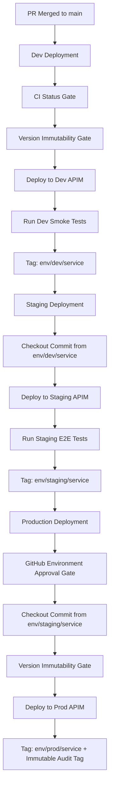

# Enterprise GitOps Architecture for OpenAPI Management & APIM Deployment

This document serves as a comprehensive reference guide and operational playbook for implementing an enterprise-grade **GitOps methodology for OpenAPI (Swagger) specifications** and deploying them across multiple environments (**Dev**, **Staging**, **Production**) to an API Gateway such as Azure API Management (APIM).

---

## 1. Executive Summary & Core Philosophy

Managing API specifications at scale presents severe challenges for engineering organizations:
- **Spec Drift**: Copying spec files into `dev/`, `staging/`, and `prod/` directories leads to out-of-sync endpoints and parameters.
- **Accidental Production Overwrites**: Modifying a spec in place can silently break downstream API consumers.
- **Untraced Deployments**: Lack of audit trails makes it hard to identify which spec version is running in which environment.

### Core Principles of This Solution

1. **Single Source of Truth**: Each API service maintains exactly **one canonical OpenAPI file** (`openapi.yaml`). Environment-specific settings (backend target URLs, rate limits, CORS/JWT policies) are decoupled into overlay files (`config/dev.json`, `config/staging.json`, `config/prod.json`).
2. **Automated Quality & Linting Gates (CI)**: Every Pull Request triggers automated linting (Spectral) and schema validation across altered services before merge.
3. **Sequential Commit Promotion (CD)**: Staging and Production always deploy the **exact commit SHA** verified in lower environments, eliminating "works in Dev, breaks in Prod" drift.
4. **Version Immutability**: Once an OpenAPI spec version (e.g. `1.3.0`) is published to Production, it becomes immutable. Modifying the spec requires bumping `info.version` (SemVer).
5. **Dual Tagging Strategy**: Integrates **moving environment pointers** (`env/dev/order-service`) for pipeline targeting alongside **immutable audit tags** (`order-service/prod/v1.3.0-g<sha>`) for auditing and rollbacks.

---

## 2. Directory Structure & Repository Layout

A monorepo structure allows central API governance while giving individual service teams granular ownership over their API specifications.

```text
.
├── .github/
│   ├── CODEOWNERS                      # Restricts approvals per API folder
│   └── workflows/
│       ├── api-ci.yml                  # PR validation (Spectral linting & schema check)
│       └── api-cd.yml                  # Script & event-driven multi-environment deployment
├── apis/
│   ├── order-service/                  # Dedicated API service directory
│   │   ├── openapi.yaml                # Canonical OpenAPI specification (Single Source of Truth)
│   │   └── config/
│   │       ├── dev.json                # Dev backend target URL & APIM policies
│   │       ├── staging.json            # Staging backend target URL & APIM policies
│   │       └── prod.json               # Production backend target URL & APIM policies
│   └── user-service/
│       ├── openapi.yaml
│       └── config/
│           ├── dev.json
│           ├── staging.json
│           └── prod.json
├── scripts/
│   ├── deploy-apim.js                  # Gateway deployment abstraction script
│   └── trigger-deploy.js               # CLI wrapper to trigger GitHub Actions CD workflows
├── .spectral.yaml                      # Linter ruleset configuration
└── OPENAPI_GITOPS_ARCHITECTURE.md      # Architecture documentation
```

---

## 3. Decoupling Specs from Environment Configuration

### 3.1 Canonical OpenAPI Specification (`openapi.yaml`)
The canonical spec contains pure contract definitions—paths, operations, request bodies, schemas, and error responses—devoid of environment-specific hostnames or tokens.

*Example excerpt from [`apis/order-service/openapi.yaml`](file:///c:/Users/marcu/Projects/AG/cicd/apis/order-service/openapi.yaml):*

```yaml
openapi: 3.0.3
info:
  title: Order Service API
  description: API for managing customer orders, cancellations, refunds, and status updates
  version: 1.3.0
paths:
  /orders:
    get:
      summary: List all orders
      operationId: listOrders
      tags:
        - Orders
      parameters:
        - name: limit
          in: query
          description: Maximum number of orders to return
          required: false
          schema:
            type: integer
            default: 10
        - name: status
          in: query
          description: Filter orders by status
          required: false
          schema:
            type: string
      responses:
        '200':
          description: A list of orders
          content:
            application/json:
              schema:
                type: array
                items:
                  $ref: '#/components/schemas/Order'
```

### 3.2 Environment Overlay Configuration (`config/*.json`)
Environment overlays inject gateway-level parameters dynamically during deployment.

*Example Dev Config ([`apis/order-service/config/dev.json`](file:///c:/Users/marcu/Projects/AG/cicd/apis/order-service/config/dev.json)):*
```json
{
  "backendUrl": "https://api-dev.internal.company.com/orders",
  "rateLimitCallsPerMinute": 1000,
  "apimPolicies": {
    "validateJwt": false,
    "corsAllowedOrigins": ["*"]
  }
}
```

*Example Production Config ([`apis/order-service/config/prod.json`](file:///c:/Users/marcu/Projects/AG/cicd/apis/order-service/config/prod.json)):*
```json
{
  "backendUrl": "https://api.company.com/orders",
  "rateLimitCallsPerMinute": 100,
  "apimPolicies": {
    "validateJwt": true,
    "corsAllowedOrigins": ["https://app.company.com"]
  }
}
```

#### Why We Use This:
- **No Spec Duplication**: Avoids maintaining multiple spec copies.
- **Security**: Production URLs and policy flags remain isolated in environment-specific configuration files.
- **Portability**: The same OpenAPI contract can be imported into any gateway instance without altering source YAML.

---

## 4. Repository Governance & Access Control (`CODEOWNERS`)

Using GitHub `CODEOWNERS`, the APIM team maintains root workflow governance while delegating authority over specific APIs to feature teams.

*Example `.github/CODEOWNERS`:*
```text
# Global APIM platform owners
*       @company/apim-platform-team

# Service-specific API ownership
/apis/order-service/  @company/order-team-leads
/apis/user-service/   @company/user-team-leads
```

#### Why We Use This:
- Ensures PRs altering `/apis/order-service/` require explicit sign-off from `@company/order-team-leads`.
- Prevents unauthorized edits to platform workflow configurations.

---

## 5. Continuous Integration (CI) Pipeline (`api-ci.yml`)

The CI pipeline runs automatically on Pull Requests and pushes to `main`. It validates OpenAPI specifications using Spectral to catch syntax and linting errors before code can be merged.

### 5.1 Matrix Strategy & Path Filtering
To scale across dozens of API services without causing slow pipeline runs, CI dynamically detects which service folders changed and runs linting jobs in parallel.

*Workflow snippet ([`.github/workflows/api-ci.yml`](file:///c:/Users/marcu/Projects/AG/cicd/.github/workflows/api-ci.yml)):*

```yaml
name: API CI - Lint & Validate

on:
  push:
    branches:
      - main
    paths:
      - 'apis/**'
      - '.spectral.yaml'
      - '.github/workflows/api-ci.yml'
  pull_request:
    branches:
      - main
    paths:
      - 'apis/**'
      - '.spectral.yaml'
      - '.github/workflows/api-ci.yml'

jobs:
  detect-changes:
    name: Detect Changed API Services
    runs-on: ubuntu-latest
    outputs:
      matrix: ${{ steps.set-matrix.outputs.matrix }}
      has_changes: ${{ steps.set-matrix.outputs.has_changes }}
    steps:
      - name: Checkout Code
        uses: actions/checkout@v4
        with:
          fetch-depth: 0

      - name: Find Changed Services
        id: set-matrix
        run: |
          if [ "${{ github.event_name }}" == "pull_request" ]; then
            CHANGED_FILES=$(git diff --name-only origin/main...HEAD)
          else
            CHANGED_FILES=$(git diff --name-only HEAD~1 HEAD 2>/dev/null || echo "apis/order-service/openapi.yaml apis/user-service/openapi.yaml")
          fi
          SERVICES=$(echo "$CHANGED_FILES" | grep '^apis/' | cut -d'/' -f2 | sort -u | jq -R . | jq -s -c .)
          echo "Detected changed API services: $SERVICES"
          echo "has_changes=true" >> $GITHUB_OUTPUT
          echo "matrix=$SERVICES" >> $GITHUB_OUTPUT

  lint-and-validate:
    name: Lint & Validate Specs
    needs: detect-changes
    runs-on: ubuntu-latest
    strategy:
      matrix:
        service: ${{ fromJson(needs.detect-changes.outputs.matrix) }}
    steps:
      - name: Checkout Code
        uses: actions/checkout@v4

      - name: Setup Node.js
        uses: actions/setup-node@v4
        with:
          node-version: '20'

      - name: Install Spectral CLI
        run: npm install -g @stoplight/spectral-cli

      - name: Lint OpenAPI Spec (Spectral)
        run: spectral lint apis/${{ matrix.service }}/openapi.yaml --ruleset .spectral.yaml
```

---

## 6. Continuous Deployment (CD) Pipeline & Safety Gates (`api-cd.yml`)

The CD pipeline handles promotion across **Dev**, **Staging**, and **Production**.



### 6.1 Safety Gate 1: CI Status Verification
Before executing any deployment, CD verifies via GitHub Checks API that CI linting passed on the target commit.

```yaml
      - name: Verify CI Status Gate
        run: |
          CHECKS_JSON=$(curl -s -H "Authorization: token ${{ secrets.GITHUB_TOKEN }}" \
            -H "Accept: application/vnd.github.v3+json" \
            https://api.github.com/repos/${{ github.repository }}/commits/${{ github.sha }}/check-runs)

          CI_CONCLUSION=$(echo "$CHECKS_JSON" | jq -r '.check_runs[] | select(.name | contains("Lint")) | .conclusion' | sort -u | head -n 1)
          if [ "$CI_CONCLUSION" != "success" ]; then
            echo "❌ ABORT DEPLOYMENT: CI check is '$CI_CONCLUSION' (must be 'success')!"
            exit 1
          fi
```

---

### 6.2 Safety Gate 2: Version Immutability Enforcement
Prevents spec modifications from being deployed to Production without bumping `info.version` in `openapi.yaml`.

```yaml
      - name: Verify Version Immutability Gate
        run: |
          PROD_TAG="env/prod/${{ matrix.service }}"
          if git rev-parse "$PROD_TAG" >/dev/null 2>&1; then
            PROD_SHA=$(git rev-parse "$PROD_TAG")
            NEW_SHA="${{ github.sha }}"

            if [ "$PROD_SHA" != "$NEW_SHA" ]; then
              PROD_VERSION=$(git show "$PROD_TAG:apis/${{ matrix.service }}/openapi.yaml" | node -e "const fs=require('fs'); const c=fs.readFileSync(0,'utf8'); const m=c.match(/version:\s*['\"]?([^'\"\s]+)['\"]?/); console.log(m ? m[1] : '1.0.0');")
              NEW_VERSION=$(node -e "const fs=require('fs'); const c=fs.readFileSync('apis/${{ matrix.service }}/openapi.yaml','utf8'); const m=c.match(/version:\s*['\"]?([^'\"\s]+)['\"]?/); console.log(m ? m[1] : '1.0.0');")

              if [ "$NEW_VERSION" == "$PROD_VERSION" ]; then
                echo "❌ ABORT DEPLOYMENT: Version '$PROD_VERSION' has already been published to Production!"
                echo "   Please bump 'info.version' in openapi.yaml before deploying."
                exit 1
              fi
            fi
          fi
```

#### Why We Use This:
- Prevents breaking published API contracts.
- Guarantees strict adherence to Semantic Versioning (SemVer).

---

### 6.3 Safety Gate 3: Sequential Promotion (Pinning Active Commit SHA)
When deploying to Staging, the CD pipeline looks up the exact commit active in **Dev** (`env/dev/<service>`). When deploying to Production, it looks up the active commit in **Staging** (`env/staging/<service>`).

```yaml
      - name: Resolve Target Commit from Staging (Sequential Promotion)
        run: |
          STAGING_TAG="env/staging/${{ matrix.service }}"
          if git rev-parse "$STAGING_TAG" >/dev/null 2>&1; then
            TARGET_SHA=$(git rev-parse "$STAGING_TAG")
            echo "📍 Sequential Promotion: Checkout commit '$TARGET_SHA' (currently active in Staging)"
            git checkout "$TARGET_SHA"
            echo "TARGET_SHA=$TARGET_SHA" >> $GITHUB_ENV
          fi
```

#### Why We Use This:
- Prevents unverified commits on `main` from jumping straight to Production.
- Guarantees that what was tested in Staging is 100% identical to what is published to Production.

---

### 6.4 Safety Gate 4: Gated Production Approval
Production jobs specify `environment: production` in GitHub Actions. GitHub Environment Protection Rules pause the pipeline until designated approvers (APIM Leads) review and approve the run.

---

## 7. Dual Tagging & Audit Strategy

Upon successful deployment, the pipeline creates two types of Git tags:

```yaml
      - name: Create & Push Deployment Git Tags
        run: |
          SPEC_VERSION=$(node -e "const fs=require('fs'); const c=fs.readFileSync('apis/${{ matrix.service }}/openapi.yaml','utf8'); const m=c.match(/version:\s*['\"]?([^'\"\s]+)['\"]?/); console.log(m ? m[1] : '1.0.0');")
          SHORT_SHA=$(echo "${{ env.TARGET_SHA }}" | cut -c1-7)
          
          AUDIT_TAG="${{ matrix.service }}/prod/v${SPEC_VERSION}-g${SHORT_SHA}"
          MOVING_TAG="env/prod/${{ matrix.service }}"

          # 1. Push Immutable Audit Tag
          git tag -f -a "$AUDIT_TAG" -m "Automated deployment of ${{ matrix.service }} v${SPEC_VERSION} to prod at commit ${SHORT_SHA}"
          git push origin "$AUDIT_TAG" --force

          # 2. Push Moving Pointer Tag
          git tag -f "$MOVING_TAG" ${{ env.TARGET_SHA }}
          git push origin "$MOVING_TAG" --force
```

| Tag Type | Format Example | Purpose | Mutability |
| :--- | :--- | :--- | :--- |
| **Immutable Audit Tag** | `order-service/prod/v1.3.0-gc963352` | Permanent record of deployment for compliance and instant rollback | **Immutable** (Point-in-time snapshot) |
| **Moving Pointer Tag** | `env/prod/order-service` | Tracks the active commit running in the environment | **Moving** (Pointers update on deployment) |

---

## 8. Gateway Deployment Abstraction Script (`deploy-apim.js`)

To decouple the CI/CD runner from specific cloud provider SDKs, deployment logic is encapsulated in a Node.js script ([`scripts/deploy-apim.js`](file:///c:/Users/marcu/Projects/AG/cicd/scripts/deploy-apim.js)).

```javascript
const fs = require('fs');
const path = require('path');

function main() {
  const args = process.argv.slice(2);
  const api = args[args.indexOf('--api') + 1];
  const env = args[args.indexOf('--env') + 1];

  const specPath = path.join(__dirname, '..', 'apis', api, 'openapi.yaml');
  const configPath = path.join(__dirname, '..', 'apis', api, 'config', `${env}.json`);

  const specContent = fs.readFileSync(specPath, 'utf8');
  const configContent = JSON.parse(fs.readFileSync(configPath, 'utf8'));

  console.log(`🌐 Step 1: Importing OpenAPI spec (${specPath}) into APIM Gateway...`);
  console.log(`🔧 Step 2: Applying environment parameters from (${configPath})...`);
  console.log(`   -> Target Backend URL: ${configContent.backendUrl}`);
  console.log(`   -> Rate Limit: ${configContent.rateLimitCallsPerMinute} calls/min`);
  console.log(`🎉 SUCCESS: '${api}' deployed successfully to APIM (${env.toUpperCase()})`);
}

main();
```

#### CLI Execution:
```bash
node scripts/deploy-apim.js --api order-service --env dev
```

---

## 9. Trigger Script Wrapper (`trigger-deploy.js`)

For developers or automated scripts triggering deployments outside GitHub UI:

```bash
node scripts/trigger-deploy.js --api order-service --env dev --token YOUR_GITHUB_PAT
```

Uses GitHub REST API (`POST /repos/{owner}/{repo}/actions/workflows/api-cd.yml/dispatches`) to trigger deployments cleanly.

---

## 10. Architectural Comparison

| Dimension | Legacy Pattern (Folder Copy) | **GitOps OpenAPI Architecture** |
| :--- | :--- | :--- |
| **Spec File Location** | Duplicated across `dev/`, `staging/`, `prod/` | Single canonical `openapi.yaml` per API |
| **Environment Values** | Hardcoded into separate YAML specs | Isolated in overlay `config/<env>.json` files |
| **Promotion Mechanism** | Copying files between folders | Automated Git tag pointer promotion |
| **Safety Gates** | Manual review | **CI Status Gate + Version Immutability Gate + Approval Gate** |
| **Auditing & History** | Tangled git history per directory | Clean commit history + **Dual Git Tagging** |

---

## 11. Summary & Operational Best Practices

1. **Keep `openapi.yaml` Contract-Pure**: Never put environment domain names inside the spec.
2. **Never Force-Push Production Tags**: Production audit tags serve as non-repudiable logs.
3. **Bump SemVer Versioning Promptly**: Treat `info.version` as a strict contract release number.
4. **Enforce CODEOWNERS**: Protect API folders from unauthorized modifications.
